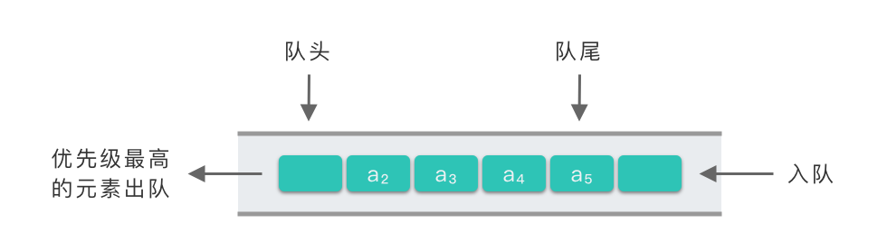

# 优先队列

## Intro

特殊的队列，元素被赋予优先级，当访问队列元素时，最高优先级元素先出列

First In，Largest out

## 优先队列的实现方式

- **数组（顺序存储）实现优先队列**：入队操作直接插入到数组队尾，时间复杂度为 𝑂(1)*O*(1)。出队操作需要遍历整个数组，找到优先级最高的元素，返回并删除该元素，时间复杂度为 𝑂(𝑛)*O*(*n*)。

- **链表（链式存储）实现优先队列**：链表中的元素按照优先级排序，入队操作需要为待插入元素创建节点，并在链表中找到合适的插入位置，时间复杂度为 𝑂(𝑛)*O*(*n*)。出队操作直接返回链表队头元素，并删除队头元素，时间复杂度为 𝑂(1)*O*(1)。

- **二叉堆结构实现优先队列**：构建一个二叉堆结构，二叉堆按照优先级进行排序。入队操作就是将元素插入到二叉堆中合适位置，时间复杂度为 𝑂(log⁡2𝑛)。出队操作则返回二叉堆中优先级最大节点并删除，时间复杂度也是 𝑂(log⁡𝑛)。

  

| 入队操作时间复杂度 | 出队操作（取出优先级最高的元素）时间复杂度 |                    |
| ------------------ | ------------------------------------------ | ------------------ |
| 堆                 | 𝑂(log⁡𝑛)*O*(log*n*)                         | 𝑂(log⁡𝑛)*O*(log*n*) |
| 数组               | 𝑂(1)*O*(1)                                 | 𝑂(𝑛)*O*(*n*)       |
| 链表               | 𝑂(𝑛)*O*(*n*)                               | 𝑂(1)*O*(1)         |

`add()`

`offer()`

`remove()`

`poll()`

`element()`

`peek()`